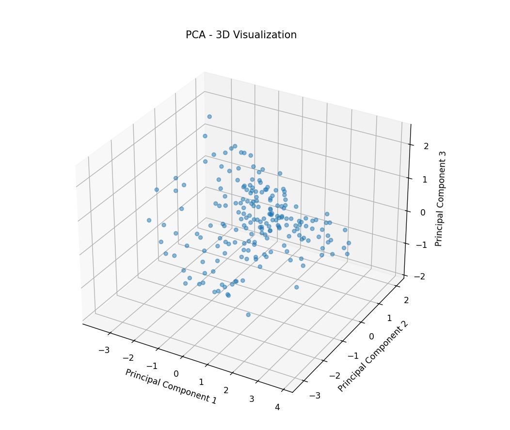
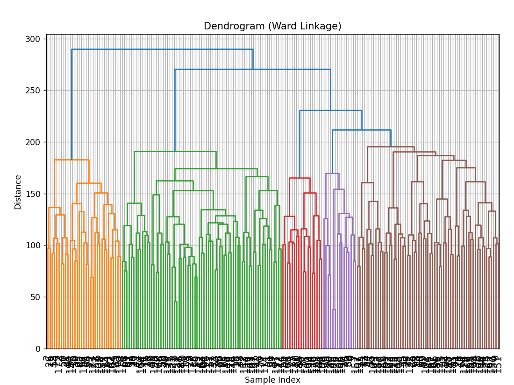

                        Assignment-2 report
                        2022112004
Question 3 KMeans
3.1_
the K-means model was implemented using LLM services by feeding the sub-part as a prompt.

3.2 
For the elbow plot , we varied k from 1 to 11 , and then from 1 to 200(num cluster = num elements) to get the 2 plots
of k vs wcss .

first elbow seemed to be at k = 2 , but the wcss was still going down rapidly so i took the elbow to be at k = 8 from where the graph seemed flatter in the 1 to 11 plot , 
seen from 1 to 200 we see the graph decreases at a steady slope so its hard to determine any elbow value from that one

resulting in my kkmeans1 being = 8

the resulting clustering was later printed in the terminal giving the following results

some clusters seemed to make somewhat sense with like-words being bunched together, but some others made no sense at all 

Question - 4 GMM

4.1 the model was generated using LLM services with the sub part as a prompt

4.2 
doing experiments on my custom model using k = 2 didnt work well as the results made no sense , they are in figures 

reasoning might be shown later as this is a very low cluster count and gmm is struggling to clump these together

we did experiments on sklearn model using the same k = 2 and it yielded similar nonsensical results,
the reasoning for this will be shown later with the aic and bic scores

where k is number of parameteres calculated as k =

the plot for aic and bic was very confusing to me since it was supposed to converge but niether of them did 

the elbow point i thought will be 2 as seen in sklearn but it performed poorly so i took it as 8 since it seemed to have subsided, 
kgmm1 = 8

gmm clustering results were as follows ->

My assumption regarding the failure of gmm and the scores to converge is that the dimensionality of the given data set is too high , GMMS are known to struggle with higher dimensional datasets

Question 5 PCA

5.1
PCA class was implemented using LLMS with the subpart as prompt

The pca check functionality was done as such it will return true as long as the transformed data pertains withing 10% of reconstruction error loss

5.2 

The fit and transform were done for num_components 2 and 3 

the following pca_check revealed both to be false , as is obvious from the cumsum variance plot ->

we see that at n = 2 and 3 , the total variation stored in the principle components doesnt even amount to 20% of the original variance of the dataset, as such the reconstruction error is huge and doesnt lie withing the 0.1 tolerance range (reconstruction error close to 80%) and makes pca_check return a false 

the visualisation of the principle components was as follows ->

identifying the axes->
since this technique is PCA , in the 2d plot the data points are plotted against 2 eigenvectors along which the maximum variance is projected in the dataset , (i.e out of all the 200 possible components these 2 axes store the most and so they are chosen to be the new basis to retain as much information as possible)

same with the 3d plot , its plotted along another axes which represents the eigenvector with the 3rd most eigenvalue of the covariance matrix of this dataset.

I can somehow make out 4 circular cluster boundaries (although not that clear in the 2d plot) from the 3d plot ,
but this is to be expected to be erroenous since we saw from the cumsum variance that these 3 axes dont even retain 20% of the total original data information.
k2= 4

Question 6 PCA + clustering
6.1 
the k-means clustering using k2 gave the following result ->

some of the entries do club together but not a lot

6.2

the scree plot is as follows ->

we see the variance value flattening after 10 components or so , during this we also ran a pca_check to see at exactly which dimension we meet our requirement of 90% reconstruction 
it turned out to be at n=107 that we get the check as true.

the optimal dimensions were chosen to be as the first 10

then we transformed the data set using pca.transform 

elbow method on reduced dataset was ->

.png>)

the new elbow was at k = 6

meaning kkmeans3 = 6

after doing kmeans using this k we got the result->

which was quite satisfactory as it separated most verbs from objects , living things , activities etc

6.3

using k2 for gmm->

again some clusters make a little sense , some dont

6.4 

we reused the reduced dataset (of n =10) from earlier and plotted the following score on doing gmms from k = 1 to 11

This time howvever, our AIC scores seemed to be converging so we were able to ascertain the new 
kgmm3 value to be at the elbow of this convergance set to 
kgmm3  = 5

the result was->

another satisfactory result similar to kkmeans3

Question 7 cluster analysis

7.1->
kkmeans1->

kkmeans2->

kkmeans3->

clearly kkmeans 3 is the most optimal one here (it also works well due to it being on the reduced dataset)

it clearly segregates and clubs most similar types of words together

7.2

kgmm1->

kgmm2->

kgmm3->

here also the kgmm3 makes the most sense , but the comparision is way easier since kgmm1 and kgmm2 with their non converging aic and bic scores made no sense in their resulting clusters either

the best result was from kgmm3 being done in a reduced dataset (from pca)

7.3 
kkmeans3->

kgmm3->

the comparision between kgmm3 and kkmeans 3 is hard, but i see more out-of-place words in the result of k-means 3 than in the results of kgmm3 so i would say that out of these 2

kgmm3 is better

Question 8

8.1->

Linkage matrix->

.png)

this is just a small snippet of it , it prints the entire one in my code.

Dendrogram->

8.2->
here comes the experimentations

the results were as follows->

method-> single 

results->

method-> complete

results->

method -> average

result->

method -> ward (best method)

distance metric (eucledien)->

distance metric (manhattan) ->

distance metric (cosine) ->

results (eucledien)->

observations state that ward is the best identified method from its most sensable clustering amongs all the other 3 methods

8.3

creating kbest1->

creating kbest2->

comparision between kbest 1 and kkmeans3 yields that it outperformed kkmeans3 by a lot ,
same with kgmm3, it was beaten by kbest2

hierarchical clustering seems to be a good clustering algorithm for word type datasets with little sample points.

Question 9

9.1->
scree plot ->

(keep in mind this is already the dataset with non numerical columns reduced (original num_components= 14))
the elbow is visible at n = 6

so we reduce the data set to 6 columns

we transformed the dataset using pca.transform and then 
implemented knn on this reduced dataset

9.2->

the evaluation metrics are as follows->

comparing with a1 results->

we used k = 71 as it was the best one found in the previous assignment,

the results show that our f1 score decreased even more, there was already something faulty with the previous result but it became worse,

my observation is that althought pca is good for reducing data complexity to prevent overfitting ,but this dataset wasnt complex to begin with , it only had 14 numerical dimensions, so reducing its dimensions at the cost of information loss made the results even worse

the time plots are->

time results:

so it clearly reduced the time taken but not by much as compared to the penalty we took for losing information 

Thank you