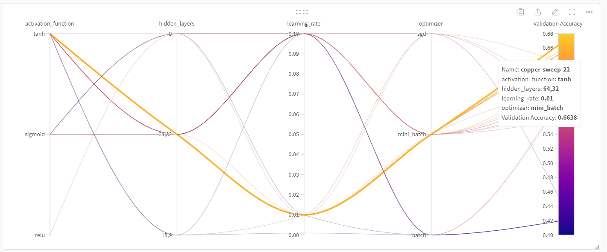
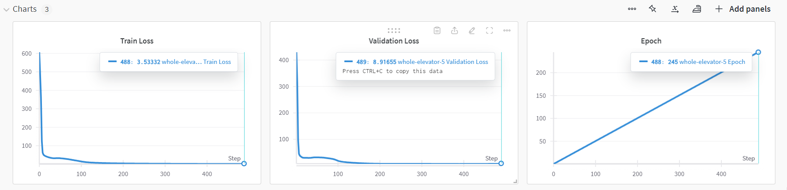
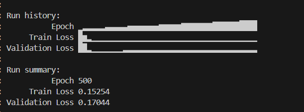

Question 2 -> MultiLayer Perceptron Classification
2.1->
dataset analysis and pre processing->

2.1.1
the description was as follows

2.1.2
the distribution of the columns attributes was as follows 

the target label was quality with this distribution->

we can see a sort of ordinal scaling with 3 being bad and 8 being good , and most of the samples lying in mediocrity (like a gaussian curve) but we still implemented the MLP class using one-hot encoding and cross - entropy loss ensuring equal weights of each class for the loss function.

2.1.3

For pre processing i removed the Id column since its not related to the classification at hand,
furthermore I implemented normalisation then standardisation for the 

2.2 
the class was made using LLM services by feeding the sub question as prompt , several adjustments were made to the encoding scheme and the activation flow along with checks of wandb inside the fit function before it started to work properly

2.3 Hyper Parameter tuning -->

2.3.1 the plot for validation_accuracy (maximisation goal) vs the hyperparameter sweep is as follows

the link to the run is 
https://wandb.ai/sharshvardhansingh324-iiit-hyderabad/mlp-classification/sweeps/gfz9i1yu?nw=nwusersharshvardhansingh324

2.3.2
I have stored the table as a csv file inside the interim folder

2.3.3

the best model was this one ->

parameters were optimiser = mini batch  , activation = tanh 
lr = 0.01 hidden layer = 64,32 

2.4

the accuracy on test set was 61ish percent with f1 score being 35.5  , precision about 35 and recall close to 37

https://wandb.ai/sharshvardhansingh324-iiit-hyderabad/MLPclassifier/runs/j23u0k2e?nw=nwusersharshvardhansingh324

2.5 Analysis of hyper parameter effects
all of these are stored in here

https://wandb.ai/sharshvardhansingh324-iiit-hyderabad/hyperparameter_analysis?nw=nwusersharshvardhansingh324

2.5.1 effect of non linearity

training set->

validation set->

tanh performed the best here , although sigmoid was also very close ,
relu didnt perform as well.

2.5.2 effect of learning rate 

training set->

validation set->

we picked 0.01 as the best lr from this 

a higher learning rate might cause instability as the model can miss fine tuned weights if it changes too drastically, while a very low learning rate might take forever to converge , so being in the middle is the best option as is seen from 0.01.

2.5.3 effect of batch size
training set->

validation set->

here sometimes 16 size performed better , but since we didnt sweep this during hyper param tuning we picked 32 as default case

2.6 
I made the class for MLMLP by taking the template of MLP and feeding certain adjustments into it from LLM side , although the class was seemingly fine logic wise , I could not get the Multilabel categories to be encoded properly in the preprocessing step of advertisemenst.csv , some of the categories seemed to be ordinal (degrees masters highschool etc) while others didnt really have a specific correlation to the target labels, which I found problematic , one solution was to just drop all the non numerical columns but that would leave me with only 2 features which wouldnt give a satisfactory result.

2.7
The analysis was made by observing the Gaussian distribution over WINEQT wine qualities , the distribution 

clearly shows a huge skew of class imbalance with the labels 5 and 6 dominating the classification , which might lead me to believe that the high accuracy of 66% was due to our classifier classifying 5 and 6 correctly , and the rarer ones badly,

I have a confusion matrix to prove my point 

ironically most of the errors also arrive from confusion between 5 and 6 as is seen from the misclassifications

the classifier seems especially bad at classifying 3 4 and 8 with 0 correct classifications

3 - > MultiLayer Perceptron Regression

3.1 Data preprocessing
3.1.1

3.1.2

this is the distribution of the target label 
3.1.3 and 3.1.4
this time there were several Na values inside the table which were promptly replaced by the mean of the column using sklearn , after that we normalised and standardise the data (except the MEDV target) and then we split it into an 80 10 10 split of train test validation sets

3.2 MLP regression class was made using LLM by feeding the subpart of the question as a prompt,
the debugging was done to ensure correct logic in the output layers and the predict being just the final activation layer 

the output size was kept to 1 as its just a value ,

MSE loss function was implemented and logged using wandb inside the fit command 

3.3 Hyper parameter tuning using W&B

3.3.1

the full sweep of hyperparameters was done with bayesian method with the target goal being minimisation of validation mse

there were 30 counts of sweep 

here is the plot ->

link->

https://wandb.ai/sharshvardhansingh324-iiit-hyderabad/mlp-regression/sweeps/x5gn1f5a?nw=nwusersharshvardhansingh324

3.3.2

sweep table is as follows ->

the csv export file is stored inside of interim folder 

3.3.3

the best model obtained was 

activation tanh, hidden layers 18.9 ,lr = 0.01, optimiser-> mini_batch  , 
and the validation MSE was 10.775

3.4 evaluating the model

when tested in isolation (with early stopping of patience 50) gave test mse of 5.45 tst rmse of 2.33 and test MAE of 1.78

with validation mse also being 8.9 (early stop at 245)

link->

https://wandb.ai/sharshvardhansingh324-iiit-hyderabad/best%20model/runs/flqszzqb?nw=nwusersharshvardhansingh324

3.5->
3.5.1
implementing the logistic regression class , we used the same template as MLPregressor but this time made changes to it so it can take the loss function ('bce' 'mse') as input , and it contains no hidden layers , just direct sigmoidal activation of input layers into a binary output ,

done with the help of llm

the changes to be made for bce were that the gradient of the loss had to change to 

A-Y/A*(1-A) instead of (A-Y)/m in the backpropogation step

and the loss function was also changed to bce loss 

3.5.2

for mse 

link ->
https://wandb.ai/sharshvardhansingh324-iiit-hyderabad/MLP%20Logistic/runs/izgcvil9?nw=nwusersharshvardhansingh324

for bce 

link->

https://wandb.ai/sharshvardhansingh324-iiit-hyderabad/MLP%20Logistic/runs/e2dnsd99?nw=nwusersharshvardhansingh324

3.5.3
we see that bce converges extremely fast but also results in a higher loss order while mse converges slower , bce has been optimised specifically for binary classification
like in the diabetes outcome

mse loss was around 0.17 while bce loss was nearly 0.56

3.6

Now for the analysis of why this was the case , we will first look at the target label classification plot and what the error was for each classification of 0 or 1 outcome for mse and bce then try to theorise why it was as it was

mse->

bce->

slight scaling issue in the graph ( 0,01 instead of 0.1)

now we see that the number of misclassifications are nearly the same in both then how come the BCE loss is so much higher?

I theorise its because of the nature of the loss function being punishing in binary case, while mse is bound to at max an error of <=1 (for 0 and 1 outcome) which causes it to be lesser even in case of a wrong classification ,

 bce is not so , it is logarithmic in nature which means it exponentially punishes a bad classification logit lying close to the wrong class, so its not distance linear in the sense that mse is . meaning a classification logit lying close to 1 when it should be 0 would be punished more heavily in case of bce since it punishes the probabilistic nature of confidently wrong classificaiton (related to entropy and uncertainity) and thereby causing a higher average loss ,

 regardless bce is still considered better for binary classification and regression problems due to its extremely fast converging nature (might cause instability)

4 Autoencoders

4.1 
the autoencoder was made using LLM services , first we tried to integrate it using command calls from MLPR (regression)
it worked but was taking a bit too long for even some simple 3 hidden layer regressions (upto a few hours) so it wasnt enough for fine tuning some parameters hence i made another autoencoder from scratch , which was based on the regressor template, but only had 3 hidden layers , the middle one being the latent_layer which needs to be extracted and the other 2 being the same (but reversed in encoding and decoding order) middle layer between the input and latent sizes, 

4.2

the autoencoder was trained on the spotify.csv dataset and reduced to 6 dimensions as proposed in the assignmen 2 (pca+knn) since we found elbow at 6 components in that assignment ,

the training was done with keeping the hidden size at 10 , the numerical columns were 14 in total (removed the true false explict) so the flow of the network was
14(input)-->10-->6(latent)-->10-->14(reconstruction)

and the subsequent X_recon and X_latent were extracted using the functions built in 4.1

to check for convergence of the dataset, we first normalised the spotify set , printed its values , then looked at the latent values 

we first got arrays of the order [-1 . -1. -1 .-1 -1 -1] in the latent extraction which meant a very poor generalisation and a very high stagnant loss of 0.9997 , 

so i switched around the activation from sigmoid to tanh , but that didnt solve much as the loss went to 0.9990 but the latent layer was still stagnant at -1,

this lead me to believe that my learning rate was too high causing the model to saturate the activation functions and giving this high loss , so i stepped it down to 0.0001 and then checked  which gave a good diverse latent array (we will see it in further pictures)
and a loss of 0.06ish which was acceptable to me .

4.3.1
now here we will apply the knncustom model to the latent dataset(reduced) obtained from autoencoder
the result was ->

still unsatisfactory (hard to tell if it is worse or better than that in assignment 1 since both are so close to 0)

4.3.2

now here comes the knn implementation 

earlier knn gave score like 

which was really bad but it didnt improve much in assignment 2 either since maybe my knn class was a bit faulty

assignment 2 result->

its hard to compare from my custom knn class implementation ,

so to make a fair comparision lets use an actually working knn class from sklearn 

here are the results ->

raw data-> k = 5

nearly 18 percent accuracy and 0.178 f1 score

encoder reduced data -> k=5

those epoch count above are from encoder and the loss is related to reconstruction error (confirms loss to be 0.06) ,

the printed array below was the latent_array of 6 dimensions to check whether the values werent saturating or not(which they werent anymore)

the metrics for knn on reduced dataset was 
accuracy nearing 10.6% 
with f1 score at 0.1053

so with this we can conclude that reducing the dataset might cause knn to perform even worse since we are experiencing a loss in information from the original dataset, knn is already a baseline classifier, feeding it less informations for the sake of time complexity will make it run faster but at the cost of its performance as is visible by the result

4.4 MLP + autoencoder

now we used the autoencoder to diminish the dimensions to 6 (from 14) and fed these into our MLP class 
(I had to make another custom encoder for the target variable Y since this time it was not an integer like wine quality , but a string , and that too there were 114 such targets (number of unique track genre))

the model performed moderately well

with the following results

nearly 30% accuracy and 27.1 F1 score on validation/test set

The run took a long time to process (we used the best model hyper params for it so 64 32 layers take a long time )

the run result were also logged on wandb

link->

https://wandb.ai/sharshvardhansingh324-iiit-hyderabad/AutoEncoder%2BMLP?nw=nwusersharshvardhansingh324

Thank you!

