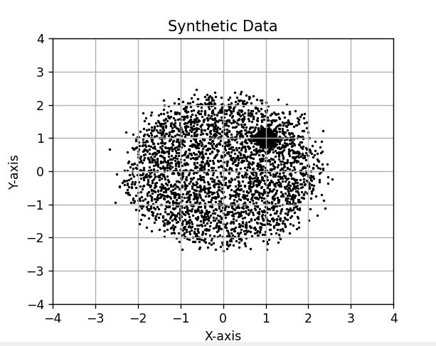

                        Assignment-5 
                Harshvardhan Singh (2022112004)

Question 2--> KDE

Task 2.1->
The architecture for the kde was made using llm services treating the subpart as a prompt, the equations used in the model were

where K() is the kernel ,h is controlling the width(bandwidth) of the kernel, and f(x) is estimating the density value

as asked gaussian ,box, triangle kernels were all implemented as options in the kdeclass

The visualisation function was also included to give the density as the third (height) axis 

Task 2.2->
The synthetic data was generated after seeing the original image and setting the radius of the big circle to 2.2 and the small circle to 0.25, the result was this

Task 2.3->

The fit for components of GMM set to 2 compared to kde model was as follows

we see that the gmm gives 2 general gaussian peaks for both circle centres ,
 but we know our dataset is like a plateau(representing the big circle) and one peak(representing the small circle with denser points) 

so in the comparision kde outperforms gmm 

when we increase the gmm components to 5 we get this result

the generalisation gets better since their are more components representing the flat region ,
But we know since kde doesnt explicitly need the number of components , it will give us a consistently good density estimation when compared to gmm

Question 3--> HMM

Task 3.2->

The dataset was downloaded and extracted as expected
I separated the data into the 10 folders labelled as the digit value for the 300 recordings inside
the MFCC coefficients were then extracted into a separate folder the n_fft (freq components)was set to 13 as is done for most audio signals, the visualisation of the mfcc coefficients is as follows
(we did a heat map)

we can see specific components activating in a timed pattern for all the digits(the yellow) , while some others are completely deactivated for certain timeframes, implying a correlation and time dependency as to what frequency components are used and at what time frame for speaking a certain digit.

we can say that each digit has its unique temporal pattern as to how the coefficients evolve

as to why HMMs might be good for this task , the actual vocal tract configurations which produce these coefficients arent observable directly from the recordings but still produce distinct outputs (different digits),so HMMs can model these underlying "hidden" states and prove useful for this task, also HMMs can handle the variability of speech(10 different people are speaking in these 3000 recordings with distinct accents) since they are probabilistic by nature

Task 3.3

the approach uses the built in library from hmmlearn , it uses 10 HMM models and indexes them and feeds each only the digit data corresponding to the digit fed into it.
For the final prediction over testing/val data ,the data is fed to all the models, it uses the log likelihood from each of the models and picks the digit corresponding to the hmm model which had the highest log likelihood over that sample of mfcc coefficients

The used HMM models have components set to 3 or 4 , since the time_frames of the individual recordings(non concatenated) were ranging from 4-8 , and it would be erronous to use more hidden states than the number of time_frames in the recordings, although we could do this for the concatenated sequence , it would defeat the purpose as it means it would be training on  the recordings as a combination instead of individually training on each.

essentially the model that fits the mfcc sequence of the sample the best( has the highest likelihood of generating the given test sequence ) is picked as the correct model , and the prediction is the digit that the model was trained on

Task 3.4->
the evaluation was performed and the following were the results

then i recorded my own recordings 1 for each digit , and placed them in the folder with the same convention(data_folder->digit_folder->digit_nameofspeaker_index.wav)
for this i didnt generate a separate folder for the mfcc coefficients but did this in the variables themselves during testing because only 10 recordings were present (1 for each digit) here is the final result

the recognition accuracy is same as baseline prediction (randomly select a digit , 1/10 chance to be correct) for the personal recordings , I think this is because mainly my recordings were not nearly as concise and compressed and noisefree as compared to the dataset recordings, 

also the training dataset had barely 4-5 timeframes for most of them , so my not-so-concise recordings consisting of 60-90 timeframes might have completely thrown the HMM out of of its curriculum resulting in poor performance, the fact it is attaining recognition accuracy of 81% on the validation dataset means that its working well for uniformly processed datasets.

Question 4-> RNN

Sub-Question -> CountingRNN

Task 4.1.1->
The dataset_generator function was generated using llm services treating the question as the prompt the , examples are printed in the terminal and the dataset is split accordingly

Task 4.1.2->

The architecture of the RNN was designed to be simple , but implemented using llm services. , It had to be simple since the dataset was moderately large so it mightve taken a lot of time to run otherwise

I use packed padded sequence since my sequences were being padded to achieve the same length(otherwise the model wasnt working as it was unable to convert to a tensor if the sequence werent uniform) (so the input was all padded to max_len) because I wanted the model to still train on variable lenght sequences, so the pack_padded thing makes the model ignore the padded bits allowing it to train on only the generated bits , also makes the model run faster

Task 4.1.3->

here is the result of the training compared to the random baseline

I got a very low (good) validation loss (MAE) of less than 
0.004 , 

The random baseline I chose was a binomial distribution baseline , the reason for this was , given 50-50 chance of getting a 1 or a 0 , in a sequence of n bits , the probabilistic distribution of getting (1,2,3...n) 1's as output follows a binomial distribution with getting n/2 1's being the highest probability,

the MAE for this random baseline was 1.5367 which is way worse than our models accuracy

Task 4.1.4->
I changed the sequence generator to now include variable max len so i could generate 1 to 32 bit sequences. now the output for this test was

My assumption for this is that the RNN is unable to adapt to the change in the expected sequence lenghts all of a sudden thus giving a very bad generalisation over these sequences.
the distribution is also sort of erratic after len 16 which it wasnt trained on

Sub Question 4.2-> Optical Character Recognition

Task 4.2.1-> 

I used the nltk to import the words , then created a dataset called ocr_dataset which had the images of the words , and the image names were the words themselves

an example is as follows

the dataset was then split into 3 folders train test split with ration 80 10 10

Task 4.2.2->

The architecture for CRNN hybrid was made using llm services feeding the subpart as a prompt, 

The layers are as follows 

even if the images are greyscale .png extension still treats them as separate 3 rgb channels with the same grayscale values

I didnt use dropout layers for this because the model was already very simple and concise (it has to train over 80k images so the model needed to be light for time constraints)

4.1.3-> 
The training went as follows , the full results are present in the notebook , but by the end of 10th epoch we achieved more than 32 percent character accuracy(both position and character value),

I printed example predictions for the odd epochs
. 
the result leads me to believe that there is a skew in the dataset generated with words starting with "ser" getting lower loss values leading the model to learn these 3 as starter letters.

The average number of correct characters can be found as 
character accuracy * avg sequence length , giving us around 
3.27 correct characters per word of the dataset

(the max len of the words were 20ish so avg word len is somewhere around 10-15)

The testing accuracy was as follows

the full output along with 32 examples have been printed in the notebook for you to check ,
this also gives us around 3.3-4 correct characters per word if we assume the same avg word len of 10-11

Now for the random baseline , I made the baseline find the most frequent character for every position in the dataset and then predict all the positions as this most frequent character ,

the final comparision was ->

we can even see some of the example predictions of the baseline model in this , you see "ser" appearing at the start proving that s followed by er is the most frequent characters for the first,second and third positions in the dataset , so our RNN also learned this statistical pattern too.

